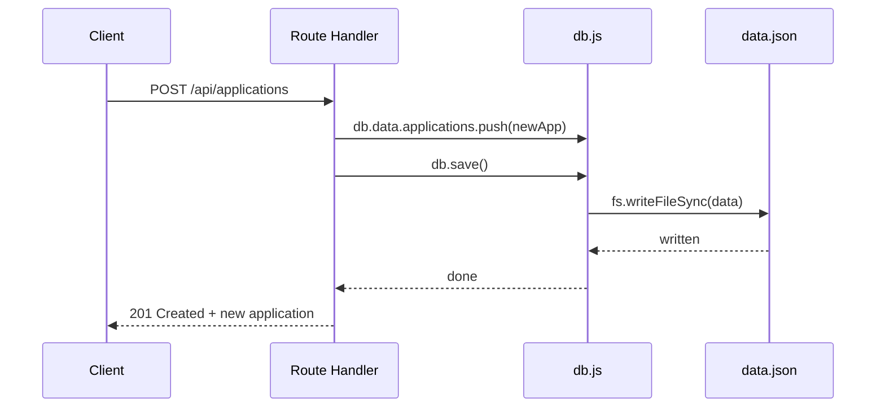
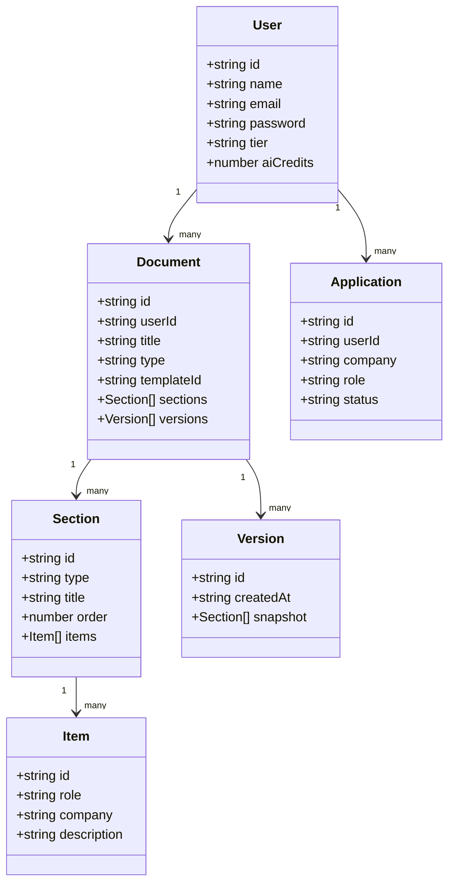
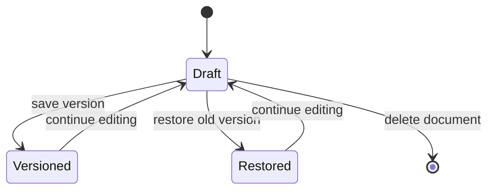

# resume-api 🧾

This is the backend for **ResumeFlow**, my AI resume builder project. It's a REST API built with Express that handles everything from auth to documents to a mock AI layer — and now it actually saves data instead of forgetting everything the moment the server restarts.

I built this as part of my Full Stack internship (Module 4, Day 13-14). Earlier version had all the routes working but data only lived in memory. This version fixes that — every write goes to `data.json` on disk, for real.

---

## What it does

- User auth (register/login/logout, mock password reset)
- User profile management
- Full document CRUD — resumes can have sections, and sections can have items (like experience entries), plus a version history so you can roll back edits
- A templates list to pick a resume layout
- A mock AI layer (bullet point rewriting, summaries) that spends "AI credits"
- A job application tracker (company, role, status)

---

## Tech stack

- **Node.js + Express** — the server
- **`data.json`** — file-based storage, no real database yet
- **Postman** — for testing routes manually

---

## Folder structure

```
resume-api/
├── app.js                  # express setup, mounts all routers
├── db.js                   # tiny "database" - loads/saves data.json
├── data.json               # the actual data (users, documents, etc.)
├── package.json
├── middleware/
│   └── mockAuth.js         # attaches a seed user to every request
└── routes/
    ├── auth.js              # register, login, logout, password reset
    ├── users.js              # get/update/delete profile
    ├── documents.js          # documents + sections + items + versions
    ├── templates.js          # read-only template list
    ├── ai.js                 # mock AI text improvements
    └── applications.js       # job application tracker
```

---

## How persistence actually works

This was the whole point of this update. `db.js` keeps one in-memory copy of `data.json`, and every single route that changes something calls `db.save()` right after, which writes the whole object back to disk.



No route is allowed to mutate `db.data` and skip the save step — that was the bug in the earlier version.

---

## Data model



---

## Document version lifecycle

A document doesn't just get overwritten when you edit it — you can save a version snapshot and restore it later if you mess something up.



---

## API routes

### Auth (`/api/auth`)
| Method | Route | What it does |
|---|---|---|
| POST | `/register` | creates a new user |
| POST | `/login` | returns a mock token |
| POST | `/logout` | mock logout |
| POST | `/forgot-password` | generates a reset token |
| POST | `/reset-password` | sets a new password using that token |

### Users (`/api/users`)
| Method | Route | What it does |
|---|---|---|
| GET | `/me` | current user's profile |
| PUT | `/me` | update name/email |
| DELETE | `/me` | deletes account + their documents + applications |

### Documents (`/api/documents`)
| Method | Route | What it does |
|---|---|---|
| GET | `/` | list my documents |
| POST | `/` | create a new document |
| POST | `/import` | create a document from imported content |
| GET | `/:id` | get one document |
| PUT | `/:id` | update title/sections |
| POST | `/:id/duplicate` | clone a document |
| DELETE | `/:id` | delete a document |
| POST | `/:id/sections` | add a section |
| PATCH | `/:id/sections/:sectionId` | update a section |
| DELETE | `/:id/sections/:sectionId` | remove a section |
| POST | `/:id/sections/:sectionId/items` | add an item to a section |
| PATCH | `/:id/sections/:sectionId/items/:itemId` | update an item |
| DELETE | `/:id/sections/:sectionId/items/:itemId` | remove an item |
| GET | `/:id/versions` | list saved versions |
| POST | `/:id/versions` | save current state as a version |
| POST | `/:id/versions/:versionId/restore` | roll back to that version |

### Templates (`/api/templates`)
| Method | Route | What it does |
|---|---|---|
| GET | `/` | list available templates |
| GET | `/:id` | get one template |

### AI (`/api/ai`) — mock, costs 1 credit per call
| Method | Route | What it does |
|---|---|---|
| POST | `/bullets` | rewrites bullet points |
| POST | `/summary` | rewrites a summary |
| POST | `/rewrite` | general rewrite |
| POST | `/prompt` | rewrite with a custom instruction |

### Applications (`/api/applications`)
| Method | Route | What it does |
|---|---|---|
| GET | `/` | list my job applications |
| POST | `/` | add a new application |
| PATCH | `/:id` | update status/company/role |
| DELETE | `/:id` | remove an application |

---

## Running it locally

```bash
npm install
node app.js
```

Server runs at `http://localhost:3000`. There's no real login yet — every request is treated as the seed user (`u1`) in `data.json`, through `middleware/mockAuth.js`. Real auth is a later module.

Test it with Postman or `Invoke-RestMethod` (curl gets weird with quotes in PowerShell, learned that the hard way):

```powershell
Invoke-RestMethod -Uri "http://localhost:3000/api/applications" -Method Post -ContentType "application/json" -Body '{"company":"Google","role":"SWE Intern"}'
```

Then check `data.json` — the new entry should be sitting right there, saved on disk, not just in memory.

---

Built this one route at a time, testing persistence properly this time instead of assuming it worked. Next up: replacing the mock auth with real JWT-based sessions. 🌸

