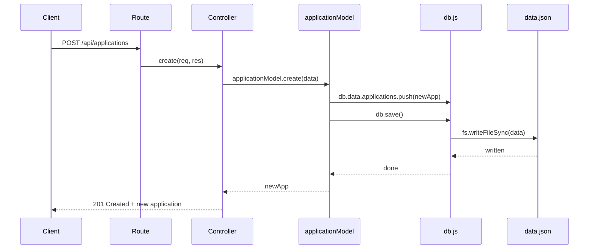
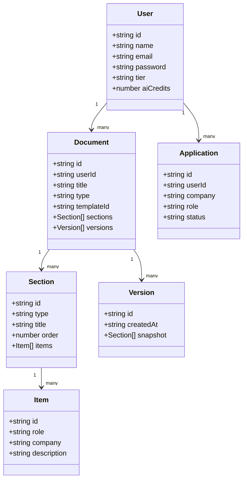
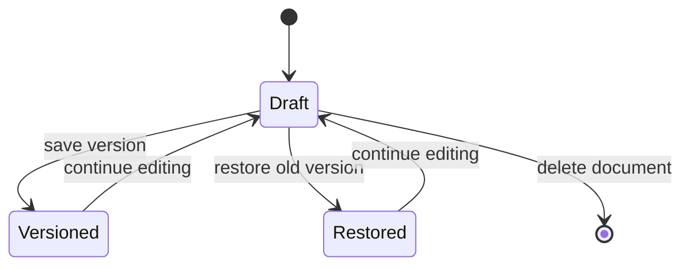

# Resume-API 🧾

This is the backend for **ResumeFlow**, my AI resume builder project. It's a REST API built with Express that handles everything from auth to documents to a mock AI layer — and now it actually saves data instead of forgetting everything the moment the server restarts.

I built this as part of my Full Stack internship (Module 4, Day 13-14). Earlier version had all the routes working but data only lived in memory. This version fixes that — every write goes to `data.json` on disk, for real.

---

## ● What it does

- User auth (register/login/logout, mock password reset)
- User profile management
- Full document CRUD — resumes can have sections, and sections can have items (like experience entries), plus a version history so you can roll back edits
- A templates list to pick a resume layout
- A mock AI layer (bullet point rewriting, summaries) that spends "AI credits"
- A job application tracker (company, role, status)

---

## ● Tech stack

- **Node.js + Express** — the server
- **`data.json`** — file-based storage, no real database yet
- **Postman** — for testing routes manually

---

## ● Folder structure

```
resume-api/
├── app.js                  # express setup, mounts the central router, applies middleware
├── db.js                   # tiny "database" - loads/saves data.json
├── data.json               # the actual data (users, documents, etc.)
├── package.json
├── middleware/
│   ├── mockAuth.js         # attaches a seed user to every request
│   └── logger.js           # logs every incoming request (method + url)
├── models/                 # only reads/writes data, nothing else
│   ├── userModel.js
│   ├── documentModel.js
│   ├── templateModel.js
│   └── applicationModel.js
├── controllers/            # the actual business logic - validation, responses
│   ├── authController.js
│   ├── userController.js
│   ├── documentController.js
│   ├── templateController.js
│   ├── aiController.js
│   └── applicationController.js
└── routes/
    ├── index.js             # central router - collects every sub-router under /api
    ├── auth.js               # just wires paths to authController
    ├── users.js               # just wires paths to userController
    ├── documents.js           # just wires paths to documentController
    ├── templates.js           # just wires paths to templateController
    ├── ai.js                  # just wires paths to aiController
    └── applications.js        # just wires paths to applicationController
```

Started as one file per resource with routes and logic mixed together. Refactored in Module 3 / Day 15 to properly separate concerns: **routes** decide which URL maps to which function, **controllers** hold the actual logic, and **models** are the only files allowed to touch `db.data` directly. Every request also passes through a `logger` middleware first, so every hit shows up in the console as `METHOD /path`.

### ▸ What each layer actually does

| Layer | Job | Example |
|---|---|---|
| **Route** (`routes/*.js`) | Maps a URL + method to a controller function. No logic here. | `router.post("/login", controller.login)` |
| **Controller** (`controllers/*.js`) | Validates the request, calls the model, decides the response and status code. | Checks `email`/`password` are present, calls `userModel.findByEmail`, returns `401` if it doesn't match |
| **Model** (`models/*.js`) | The only place allowed to read or write `db.data`. Controllers never touch it directly. | `userModel.findByEmail(email)`, `userModel.create(data)` |

The point of splitting it this way: if the data storage ever changes (say, a real database instead of `data.json`), only the `models/` files need to change — routes and controllers stay untouched because they only ever talk to the model functions, never to `db.js` directly.

---

## ● How persistence actually works

This was the whole point of this update. `db.js` keeps one in-memory copy of `data.json`. Models are the only files that touch `db.data` — every model function that changes something calls `db.save()` right after, which writes the whole object back to disk.



No model is allowed to mutate `db.data` and skip the save step — that was the bug in an earlier version.

---

## ● Data model



---

## ● Document version lifecycle

A document doesn't just get overwritten when you edit it — you can save a version snapshot and restore it later if you mess something up.



---

## ● API routes

### ▸ Auth (`/api/auth`)
| Method | Route | What it does |
|---|---|---|
| POST | `/register` | creates a new user |
| POST | `/login` | returns a mock token |
| POST | `/logout` | mock logout |
| POST | `/forgot-password` | generates a reset token |
| POST | `/reset-password` | sets a new password using that token |

### ▸ Users (`/api/users`)
| Method | Route | What it does |
|---|---|---|
| GET | `/me` | current user's profile |
| PUT | `/me` | update name/email |
| DELETE | `/me` | deletes account + their documents + applications |

### ▸ Documents (`/api/documents`)
| Method | Route | What it does |
|---|---|---|
| GET | `/hello` | simple check route, returns a fixed message |
| GET | `/` | list my documents |
| POST | `/` | create a new document |
| POST | `/import` | create a document from imported content |
| GET | `/:id` | get one document |
| PUT | `/:id` | update title/sections |
| POST | `/:id/duplicate` | clone a document |
| DELETE | `/:id` | delete a document |
| POST | `/:id/sections` | add a section |
| PATCH | `/:id/sections/:sectionId` | update a section |
| DELETE | `/:id/sections/:sectionId` | remove a section |
| POST | `/:id/sections/:sectionId/items` | add an item to a section |
| PATCH | `/:id/sections/:sectionId/items/:itemId` | update an item |
| DELETE | `/:id/sections/:sectionId/items/:itemId` | remove an item |
| GET | `/:id/versions` | list saved versions |
| POST | `/:id/versions` | save current state as a version |
| POST | `/:id/versions/:versionId/restore` | roll back to that version |

### ▸ Templates (`/api/templates`)
| Method | Route | What it does |
|---|---|---|
| GET | `/` | list available templates |
| GET | `/:id` | get one template |

### ▸ AI (`/api/ai`) — mock, costs 1 credit per call
| Method | Route | What it does |
|---|---|---|
| POST | `/bullets` | rewrites bullet points |
| POST | `/summary` | rewrites a summary |
| POST | `/rewrite` | general rewrite |
| POST | `/prompt` | rewrite with a custom instruction |

### ▸ Applications (`/api/applications`)
| Method | Route | What it does |
|---|---|---|
| GET | `/` | list my job applications |
| POST | `/` | add a new application |
| PATCH | `/:id` | update status/company/role |
| DELETE | `/:id` | remove an application |

---

## ● Running it locally

```bash
npm install
node app.js
```

Server runs at `http://localhost:3000`. There's no real login yet — every request is treated as the seed user (`u1`) in `data.json`, through `middleware/mockAuth.js`. Real auth is a later module.

Test it with Postman or `Invoke-RestMethod` (curl gets weird with quotes in PowerShell, learned that the hard way):

```powershell
Invoke-RestMethod -Uri "http://localhost:3000/api/applications" -Method Post -ContentType "application/json" -Body '{"company":"Google","role":"SWE Intern"}'
```

Then check `data.json` — the new entry should be sitting right there, saved on disk, not just in memory.

---

## ● Tested and working

Ran every route through Postman before calling this done — here's proof the persistence actually works.

**GET `/api/documents`** — returns the seed document, confirming the server reads from `data.json` correctly:


**POST `/api/applications`** — created a new job application, got back a clean `201 Created`. Checked `data.json` right after and the entry was sitting there on disk, not just in memory:


### ▸ Re-verified after the Day 15 refactor

Moving all the logic into controllers and models could easily have broken something silently, so I re-ran the same two requests against the new structure before pushing.

**GET `/api/documents`** — still returns the seed document correctly through the new `documentController` → `documentModel` path:


**POST `/api/applications`** — still returns `201 Created` with the `status` field intact through the new `applicationController` → `applicationModel` path:


### ▸ Day 15 checkpoint: hello route

The class exercise was to trace one simple route end to end through the new structure before moving to full CRUD. Added `GET /api/documents/hello`, tested in Postman:


---

## ● Wrapping up

Built one route at a time, with persistence verified through Postman rather than assumed. Next up: replacing the mock auth with real JWT-based sessions.

*— Tanushree😊*

