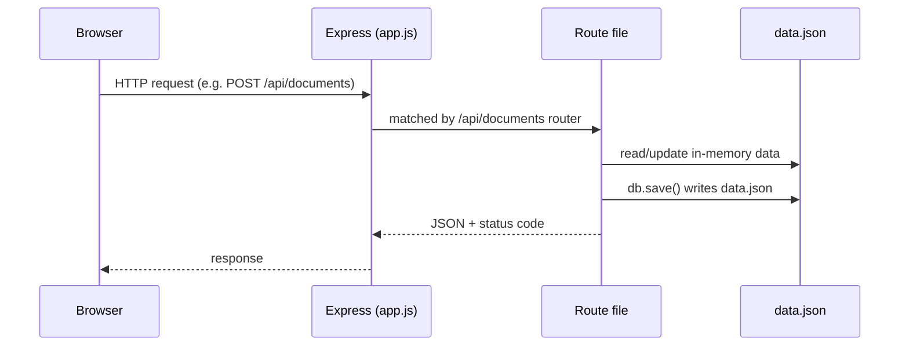

# resume-api

Backend for the **AI Resume Builder** — Day 13 task, Module 4 (Backend), Full-Stack Internship.

Built with **Express**, one server, clean route files. Data is stored in `data.json` (read into memory on start, written back on every change) — no real database yet, that's next module. Auth and AI routes return sensible mock responses since we haven't built real login or real AI yet — today was about getting every route and JSON shape working.

## How to run it

```bash
npm install
npm start
```

Server runs at `http://localhost:3000`. There's no real login yet, so every request is treated as the one seed user in `data.json` (`u1`, tanushree@example.com) — no Authorization header needed to test `GET` routes straight from the browser.

Test any route with curl, e.g.:

```bash
curl http://localhost:3000/api/documents
curl -X POST http://localhost:3000/api/documents -H "Content-Type: application/json" -d '{"title":"My Resume","type":"resume"}'
```

## Request flow



## Project structure

```
resume-api/
  app.js              # express setup, mounts every router
  db.js                # loads/saves data.json, generates ids
  middleware/
    mockAuth.js         # attaches the seed user as req.user (no real login yet)
  routes/
    auth.js
    users.js
    documents.js         # documents + nested sections/items + versions
    templates.js
    ai.js
    applications.js
  data.json             # the "database" for now
```

## Every route built

### Auth (`/api/auth`) — mock responses, no real login yet
| Method | Endpoint | Purpose |
|---|---|---|
| POST | `/api/auth/register` | Create account |
| POST | `/api/auth/login` | Obtain an access token |
| POST | `/api/auth/logout` | Invalidate the session |
| POST | `/api/auth/forgot-password` | Begin password recovery |
| POST | `/api/auth/reset-password` | Complete password reset |

### Users (`/api/users`)
| Method | Endpoint | Purpose |
|---|---|---|
| GET | `/api/users/me` | Current profile, tier, AI credits |
| PUT | `/api/users/me` | Update profile |
| DELETE | `/api/users/me` | Delete account and data |

### Documents (`/api/documents`) — the core resource
| Method | Endpoint | Purpose |
|---|---|---|
| GET | `/api/documents` | List my resumes and cover letters |
| POST | `/api/documents` | Create one (blank or from a template) |
| POST | `/api/documents/import` | Create one from an upload or LinkedIn data |
| GET | `/api/documents/:id` | Read one with its full content |
| PUT | `/api/documents/:id` | Save edits |
| POST | `/api/documents/:id/duplicate` | Copy it (a tailored version) |
| DELETE | `/api/documents/:id` | Delete it |

### Sections & items (nested under a document)
| Method | Endpoint | Purpose |
|---|---|---|
| POST | `/api/documents/:id/sections` | Add a section |
| PATCH | `/api/documents/:id/sections/:sectionId` | Edit or reorder a section |
| DELETE | `/api/documents/:id/sections/:sectionId` | Remove a section |
| POST | `/api/documents/:id/sections/:sectionId/items` | Add an entry |
| PATCH | `/api/documents/:id/sections/:sectionId/items/:itemId` | Edit or reorder an entry |
| DELETE | `/api/documents/:id/sections/:sectionId/items/:itemId` | Remove an entry |

I kept the whole-document `PUT` above **and** these nested routes, since the task asked for both — nested routes matter if we want autosave-per-field later.

### Versions
| Method | Endpoint | Purpose |
|---|---|---|
| GET | `/api/documents/:id/versions` | List saved versions |
| POST | `/api/documents/:id/versions` | Save the current state as a version |
| POST | `/api/documents/:id/versions/:versionId/restore` | Roll back to one |

### Templates (`/api/templates`)
| Method | Endpoint | Purpose |
|---|---|---|
| GET | `/api/templates` | List available designs |
| GET | `/api/templates/:id` | One template's config |

### AI (`/api/ai`) — mock output, each call costs one AI credit
| Method | Endpoint | Purpose |
|---|---|---|
| POST | `/api/ai/bullets` | Generate or improve bullet points |
| POST | `/api/ai/summary` | Generate a summary or headline |
| POST | `/api/ai/rewrite` | Tighten or improve selected text |
| POST | `/api/ai/prompt` | Apply a freeform instruction to a section |

Mock output just appends `" (improved)"` to the input text — the point today was the routes and shapes, not real AI.

### Applications (`/api/applications`) — job tracker
| Method | Endpoint | Purpose |
|---|---|---|
| GET | `/api/applications` | List tracked applications |
| POST | `/api/applications` | Log one |
| PATCH | `/api/applications/:id` | Update status |
| DELETE | `/api/applications/:id` | Remove one |

## Status codes used

- `200` — successful read/update
- `201` — resource created
- `204` — successful delete (no body)
- `400` — missing/invalid input
- `401` — auth failed / not enough AI credits
- `404` — resource not found

## Notes

- Not built yet (mentioned as optional in the spec): ATS check, tailoring, exports, sharing. Same pattern as everything else here — POST for an action, GET to read — can be added the same way later.
- `req.body` works because `express.json()` is turned on in `app.js`.
- Every write goes through `db.save()` in `db.js`, so `data.json` always reflects the latest state.
