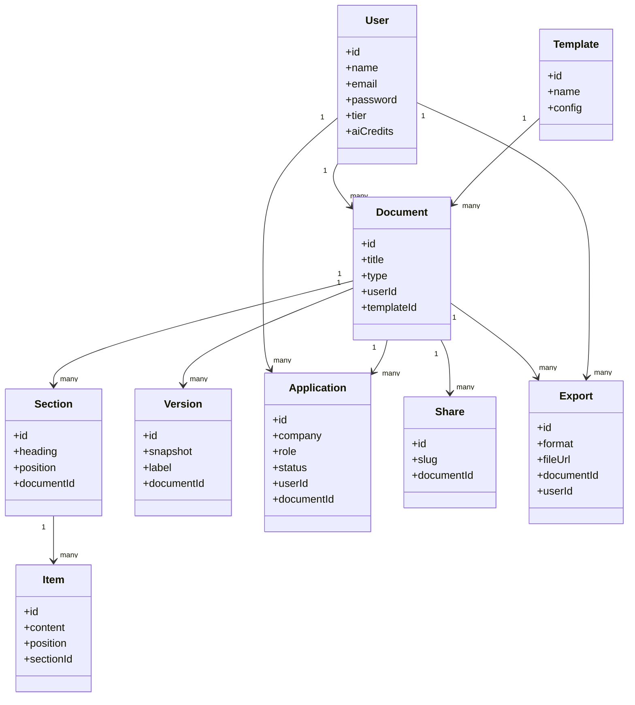
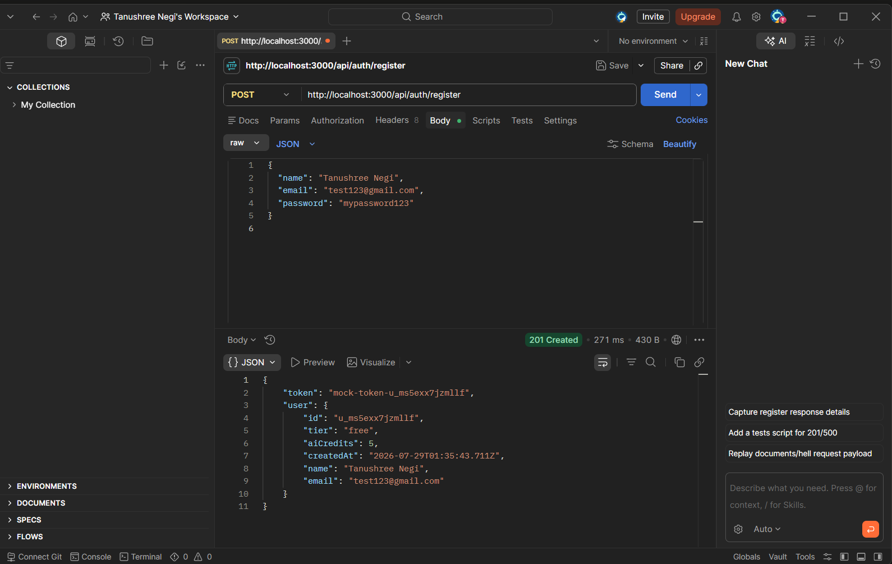
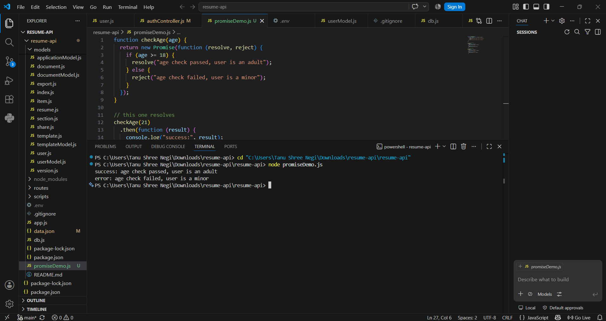
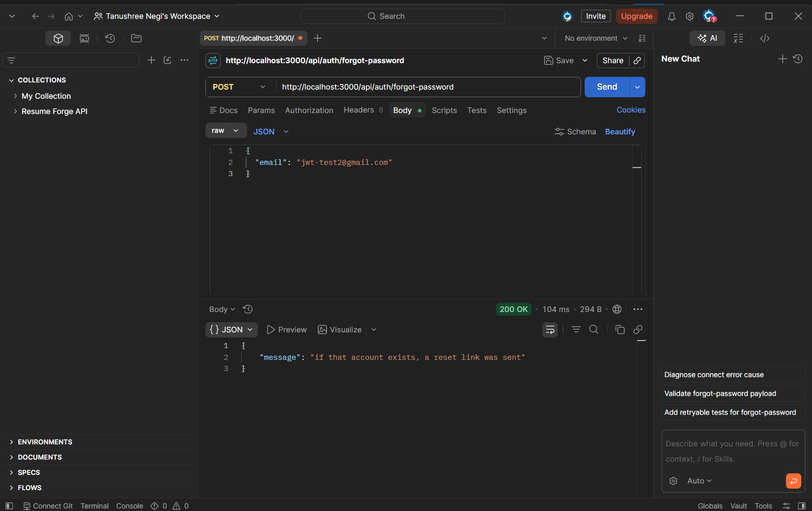
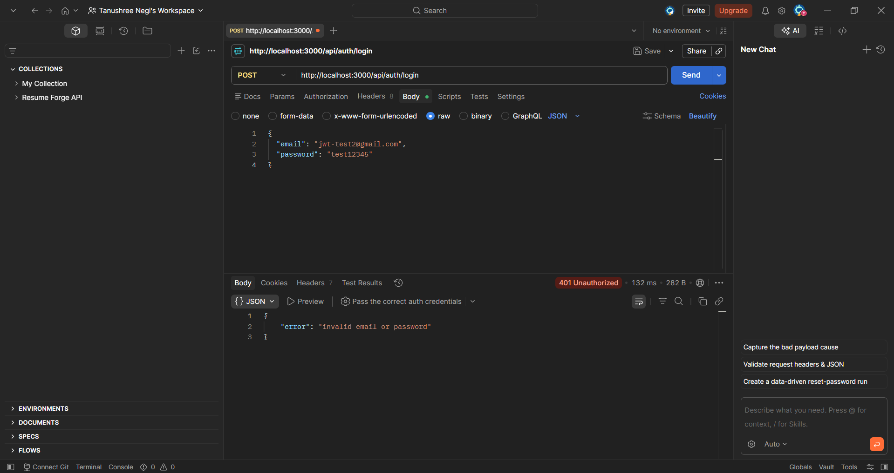

# Day 22-24: Database Schema, Auth, and JWT

This covers three days of my Full Stack internship, Module 4 — building out the full database schema with Sequelize, then layering real authentication on top of it: register/login/reset with hashed passwords, and finally real JWT tokens replacing the mock ones I started with.

---

## ● Day 22: Building the Database with Sequelize

Before writing any API code, this day was about telling the database what our data actually looks like. Nine tables, defined through nine `model:generate` commands, each one writing two files at once.

### ▸ The nine commands

```
npx sequelize-cli model:generate --name User --attributes name:string,email:string,password:string,tier:enum:'{free,pro}',aiCredits:integer
npx sequelize-cli model:generate --name Template --attributes name:string,config:text
npx sequelize-cli model:generate --name Document --attributes title:string,type:enum:'{resume,cover_letter}',userId:integer,templateId:integer
npx sequelize-cli model:generate --name Section --attributes heading:string,position:integer,documentId:integer
npx sequelize-cli model:generate --name Item --attributes content:text,position:integer,sectionId:integer
npx sequelize-cli model:generate --name Version --attributes snapshot:text,label:string,documentId:integer
npx sequelize-cli model:generate --name Application --attributes company:string,role:string,status:enum:'{saved,applied,interview,offer,rejected}',userId:integer,documentId:integer
npx sequelize-cli model:generate --name Share --attributes slug:string,documentId:integer
npx sequelize-cli model:generate --name Export --attributes format:enum:'{pdf,docx}',fileUrl:string,documentId:integer,userId:integer
```

Each command creates two files that already match each other:

- a **model** in `models/` — the JavaScript object my code talks to every day
- a **migration** in `migrations/` — the one-time instructions that actually build the table

I kept mixing these up at first. The migration builds the shelf, the model is how I put things on and take things off that shelf.

### ▸ The schema



### ▸ Associations

After the migrations, I went into each model and filled in the empty `associate()` function Sequelize leaves blank by default:

```javascript
Document.belongsTo(models.User, { foreignKey: 'userId' });
Document.belongsTo(models.Template, { foreignKey: 'templateId' });
Document.hasMany(models.Section, { foreignKey: 'documentId', onDelete: 'CASCADE' });
Document.hasMany(models.Version, { foreignKey: 'documentId', onDelete: 'CASCADE' });
Document.hasMany(models.Application, { foreignKey: 'documentId', onDelete: 'CASCADE' });
Document.hasMany(models.Share, { foreignKey: 'documentId', onDelete: 'CASCADE' });
Document.hasMany(models.Export, { foreignKey: 'documentId', onDelete: 'CASCADE' });
```

`belongsTo` means this table points to the other one. `hasMany` means the other table points back, potentially many times. `onDelete: CASCADE` means if the parent gets deleted, the connected rows get deleted automatically instead of turning into orphaned data.

Ran `npx sequelize-cli db:migrate` after this, and all 9 tables showed up in MySQL Workbench.

**What I ran into:** my project already had a `Resume` model and table from an earlier database exercise, so there was a small naming conflict with the new class schema's `Document`. I kept `Document` going forward since that's what the class uses, and left the old `Resume` table alone instead of deleting anything with real data in it.

**What I learned:**
- A migration is instructions, run once, to build a table. A model is what my running code uses every day.
- The foreign key is a column in the database. The association is what tells Sequelize how to use that column to actually pull related data together.
- `onDelete: CASCADE` matters — I don't want orphaned sections and versions sitting around with no parent document.

---

## ● Day 23: Register API, Password Hashing, and Promises

### ▸ Register API

Built the `/api/auth/register` endpoint. It takes a name, email, and password, checks the email isn't already used, saves the user, and returns a token right away — so the user is logged in immediately after signing up.

Tested it in Postman early on, back when the token was still the mock version:



### ▸ Password hashing

A password should never be stored the way it was typed. I used `bcrypt.hash()` to scramble it before saving — what actually sits in my database is that scrambled version, never the real password.

### ▸ Why hashing is one-way on purpose

Hashing can't be reversed. Even I, looking directly at my own database, can't read anyone's real password. At login, I hash whatever was just typed and compare the two scrambled versions with `bcrypt.compare()` instead of comparing plain text. So even if a database ever leaked, nobody's actual password would be exposed.

### ▸ Promises

A Promise is how JavaScript handles something that takes time without freezing everything else while it waits. Three states — pending (waiting), resolved (worked), rejected (failed). `.then()` runs on success, `.catch()` runs on failure.

I wrote a small demo to see this behave for real:

```javascript
function checkAge(age) {
  return new Promise(function (resolve, reject) {
    if (age >= 18) {
      resolve("age check passed, user is an adult");
    } else {
      reject("age check failed, user is a minor");
    }
  });
}

checkAge(21)
  .then(function (result) {
    console.log("success:", result);
  })
  .catch(function (error) {
    console.log("error:", error);
  });

checkAge(15)
  .then(function (result) {
    console.log("success:", result);
  })
  .catch(function (error) {
    console.log("error:", error);
  });
```

Ran it in the terminal to confirm both branches actually fire:



Output:
```
success: age check passed, user is an adult
error: age check failed, user is a minor
```

### ▸ Callback hell, and why async/await fixes it

Before Promises, chained slow steps were handled with callbacks nested inside callbacks — the code drifts to the right the deeper it goes, and error handling gets messy at every level.

Promises flatten that into one `.then` chain. `async/await` goes a step further — the slow steps read top to bottom like normal synchronous code, and all the error handling lives in one `try/catch` instead of being scattered.

This is exactly why `register` and `login` in my `authController.js` are `async` functions using `await bcrypt.hash(...)` instead of chaining `.then()` calls everywhere.

---

## ● Day 24: Real Authentication with JWT

Day 23 got the register/login/hashing logic working with mock tokens (`mock-token-${user.id}`). Day 24 replaced those with real signed JWTs, and covered how tokens and npm package versions actually work.

### ▸ Register, login, reset password

- **Register** — hashes the password, saves the user, returns a real JWT so the user is logged in right after signup
- **Login** — checks the typed password against the stored hash with `bcrypt.compare()`, returns a fresh token if it matches
- **Reset password** — replaces the stored hash with a new one, so the old password stops working immediately

```javascript
const jwt = require("jsonwebtoken");
const SECRET = process.env.JWT_SECRET;

const token = jwt.sign({ id: user.id }, SECRET, { expiresIn: "7d" });
```

The secret lives in `.env`, never hardcoded in the file itself.

### ▸ What a JWT actually is

Three parts joined by dots — `header.payload.signature`. The payload holds data like the user id, and **anyone with the token can read it** (I confirmed this on jwt.io — the payload decodes without needing any secret), so nothing sensitive ever goes in there. The signature is made with the server's secret key — change even one character of the token, and `jwt.verify()` rejects it instantly. That's the whole security model behind one line: `jwt.verify(token, SECRET)`.

### ▸ npm versioning — `^` and `~`

A version is `MAJOR.MINOR.PATCH`, like `4.17.21`.

| Symbol | Example | Accepts |
|--------|---------|---------|
| none | `4.17.21` | exactly that version, nothing else |
| `~` (tilde) | `~4.17.21` | patch updates only — `4.17.22` |
| `^` (caret) | `^4.17.21` | minor + patch — `4.18.0`, `4.99.9`, never `5.0.0` |

Checked my own `package.json` — everything in it uses `^`:

```json
"bcryptjs": "^3.0.3",
"express": "^5.2.1",
"jsonwebtoken": "^9.0.3",
"mysql2": "^3.23.1",
"sequelize": "^6.37.8"
```

So `npm install` can bump any of these to a newer minor or patch release automatically, but will never jump to a new major version on its own — because a major version bump can carry breaking changes.

---

## ● Proof it actually works

Tested the full auth flow through Postman rather than assuming it worked.

**Forgot password generates a reset token behind the scenes:**



**Reset password actually updates the stored hash (200):**


**The old password stops working immediately after reset (401):**



Also confirmed directly in `data.json` that every registered user's `password` field is a bcrypt hash (`$2b$10$...`), never the plain text that was typed in.

And on jwt.io — took a real token, decoded the payload to see my own user id sitting there in plain view, then changed one character of the encoded token and watched the signature verification flip to invalid.

---

## ● What I learned across these three days

- A migration builds the table once. A model is what the running app actually uses.
- Associations are how Sequelize turns a foreign key column into something my code can actually use to pull related data together.
- Hashing protects passwords even if the database itself gets compromised — that's the entire point of it being one-way.
- A JWT payload is readable by anyone holding the token. It's the signature, not secrecy of the payload, that makes it trustworthy.
- `async/await` isn't a different thing from Promises, it's a cleaner way of writing code that's already using them underneath.
- `^` in package.json is more permissive than I assumed — it can pull in a lot of minor version changes automatically, which is fine for patches and small features but still worth knowing about before assuming my dependencies are frozen.

---

~**tanushree**🪼
